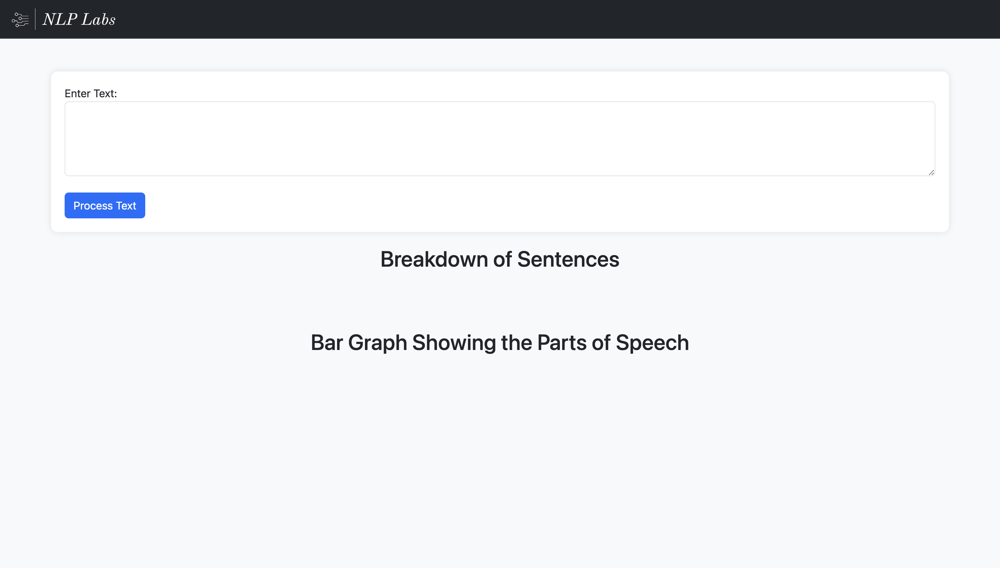

This is an application which uses stanfordnlp and performs natural langauge processing on a text entered.

This Application uses Javascript, Flask, HTML, CSS.

The Application is deployed and hosted on AWS EC2 Instance: http://18.218.82.114:5000/

To Deploy, the application is dockerized.

For Local build steps:

2. install stanfordnlp core server
3. Fire it up with the command: java -mx4g -cp "*" edu.stanford.nlp.pipeline.StanfordCoreNLPServer -port 9000 -timeout 15000
4. pip/pip3 install requirements.txt
5. run python/python3 app.py
6. Enter any text in the text field, the output shows the sentence breakdown along with the tokens and a bar graph at the bottom, which shows the count of parts of speech in the text entered.

Below are the Screenshots:

